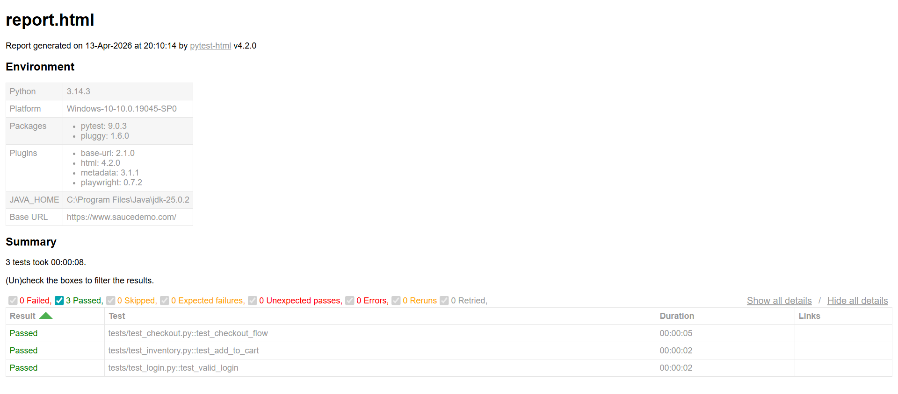

# 🧪 SauceDemo Playwright Automation Framework

This project demonstrates an end-to-end UI automation testing framework for the **Sauce Demo** application using modern QA tools and best practices.

---

## 🚀 Tech Stack

* 🐍 Python
* 🎭 Playwright
* 🧪 Pytest
* 📊 pytest-html (Reporting)

---

## 📁 Project Structure

```
saucedemo-playwright-pytest/
│
├── tests/
│   ├── test_login.py
│   ├── test_inventory.py
│   ├── test_checkout.py
│
├── pages/
│   ├── base_page.py
│   ├── login_page.py
│   ├── inventory_page.py
│   ├── checkout_page.py
│
├── utils/
│   ├── config.py
│   ├── test_data.py
│
├── conftest.py
├── pytest.ini
├── requirements.txt
└── README.md
```

---

## ✅ Features

* ✔ Page Object Model (POM) design pattern
* ✔ Automated Login functionality
* ✔ Add to Cart functionality
* ✔ End-to-End Checkout flow
* ✔ HTML Test Report generation
* ✔ Scalable and maintainable framework structure

---

## ⚙️ Setup Instructions

### 1️⃣ Clone the repository

```
git clone https://github.com/your-username/saucedemo-playwright-python
cd saucedemo-playwright-pytest
```

---

### 2️⃣ Create virtual environment

```
python -m venv .venv
.venv\Scripts\activate
```

---

### 3️⃣ Install dependencies

```
pip install -r requirements.txt
playwright install
```

---

## ▶️ Running Tests

Run all tests:

```
pytest
```

Run a specific test file:

```
pytest tests/test_login.py
```

---

## 📊 Test Report

After execution, a report will be generated:

```
report.html
```

Open it in your browser to view:

* Test results (Pass/Fail)
* Execution time
* Detailed logs

---

## Screenshots

 

## 💡 Key Highlights

* Designed using industry-standard automation practices
* Supports easy scalability for additional test cases
* Clean separation of test logic and page elements
* Ready for CI/CD integration

---

## 🚀 Future Improvements

* 🔹 Add Allure Reporting
* 🔹 Parallel Test Execution
* 🔹 CI/CD integration (GitHub Actions)
* 🔹 Negative & Edge Case Testing
* 🔹 Cross-browser testing

---

## 👨‍💻 Author

**Abrar Nawar Alfy**

---
